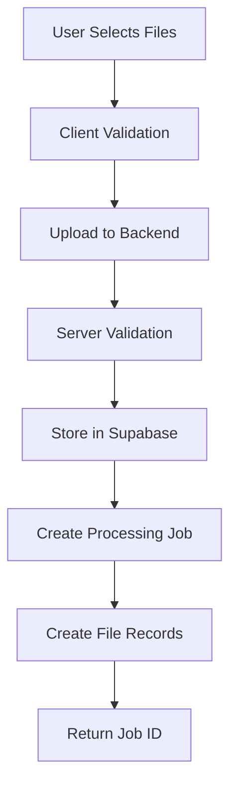
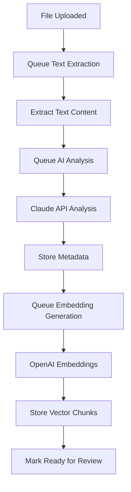
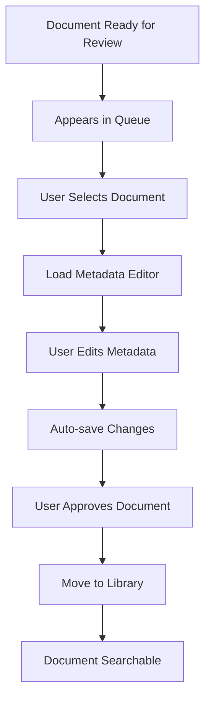
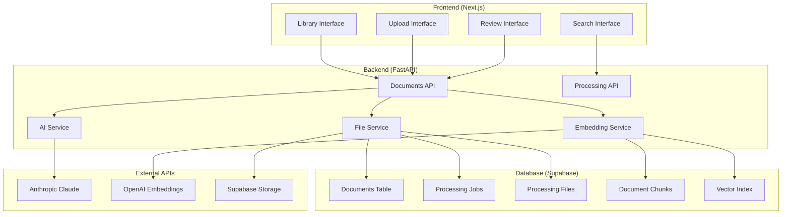
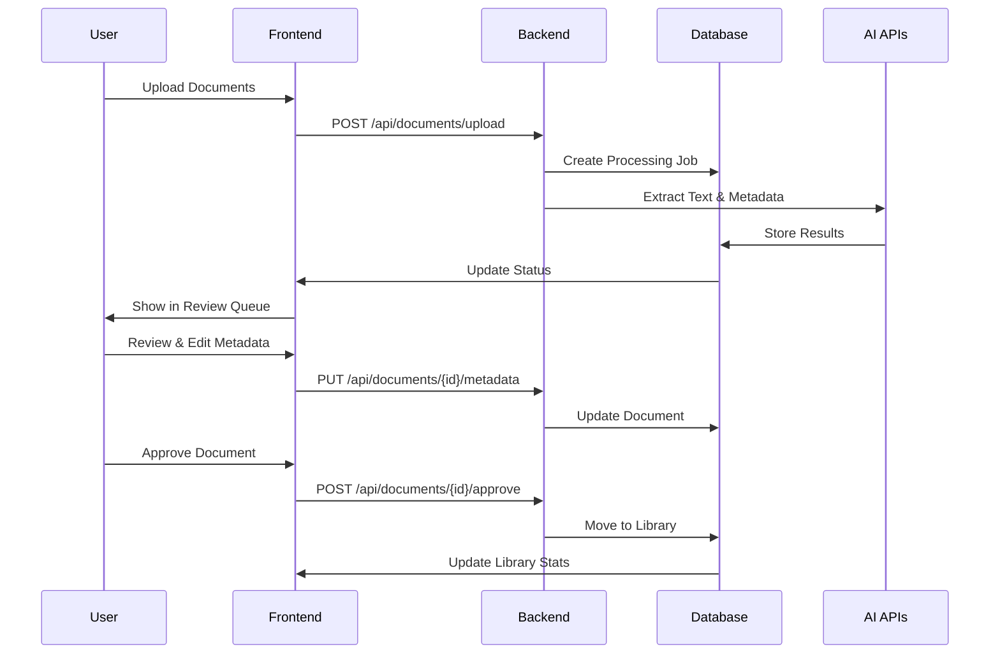

# TBG RAG Document Ingestion Workflow - Integrated Implementation Guide

**Document Version**: 2.0
**Date**: 2025-08-22
**Status**: Implementation in Progress
**Replaces**: document-ingestion-workflow-complete.md

---

## Table of Contents

1. [System Overview](#system-overview)
2. [End-to-End Workflow](#end-to-end-workflow)
3. [Implementation Status](#implementation-status)
4. [User Interface Design](#user-interface-design)
5. [Unified Implementation Roadmap](#unified-implementation-roadmap)
6. [Technical Architecture](#technical-architecture)
7. [API Specifications](#api-specifications)
8. [Database Schema](#database-schema)

---

## System Overview

The TBG RAG Document Ingestion System is designed to process legal documents through an automated pipeline with human review checkpoints. The system extracts metadata using AI, generates vector embeddings for semantic search, and maintains a curated library of approved documents.

### Key Capabilities

- **Automated Processing**: Documents progress through extraction, AI analysis, and embedding generation
- **Human-in-the-Loop Review**: Legal experts review and edit AI-extracted metadata
- **Semantic Search**: Vector-based similarity search across document content
- **Multi-format Support**: PDF, DOCX, TXT, and Markdown documents
- **Legal-specific Metadata**: Case law, expert reports, statutes with specialized fields

### System Components

- **webapp-backend**: FastAPI backend with processing services
- **webapp-frontend**: Next.js frontend (to be implemented)
- **Supabase**: PostgreSQL database with vector extensions
- **External APIs**: Anthropic Claude (AI), OpenAI (embeddings)

---

## End-to-End Workflow

### Phase 1: Document Upload and Validation

#### User Experience Flow
1. **Access Upload Interface**
   - User navigates to Library → Ingest tab
   - Sees upload dropzone and file queue

2. **File Selection and Upload**
   - Drag-and-drop files or click "Select Documents"
   - System validates file types (PDF, DOCX, TXT, MD)
   - System validates file sizes (max 50MB each, max 10 files per batch)

3. **Upload Processing**
   - Files uploaded to Supabase storage
   - Processing job created with unique batch ID
   - Individual processing file records created
   - User receives upload confirmation with job ID

#### Implementation Status: ✅ **IMPLEMENTED**
- ✅ File upload endpoint (`POST /api/documents/upload`)
- ✅ File validation (size, type, batch limits)
- ✅ Supabase storage integration
- ✅ Processing job creation
- ✅ Error handling and user feedback

#### Technical Flow


---

### Phase 2: Automated Document Processing

#### Background Processing Pipeline

**2.1 Text Extraction**
- System extracts text from uploaded documents
- PDF processing using PyMuPDF
- DOCX processing using python-docx
- Text quality validation and cleanup

**2.2 AI Metadata Analysis**
- Extracted text sent to Anthropic Claude API
- Structured prompts for legal document analysis
- Extraction of:
  - Document type (case_law, expert_report, statute, etc.)
  - Title and summary
  - Legal metadata (case name, court, jurisdiction)
  - Practice area and categories
  - Confidence scores for extracted data

**2.3 Vector Embedding Generation**
- Text chunked into optimal segments (1000 chars, 200 overlap)
- Chunks sent to OpenAI embeddings API
- Vector embeddings stored in document_chunks table
- Semantic search index updated

#### Implementation Status: ⚠️ **PARTIAL/UNCLEAR**
- ⚠️ Text extraction service exists but needs verification
- ⚠️ AI service exists but implementation unclear
- ⚠️ Embedding service exists but needs verification
- ❌ **MISSING**: Automatic background processing pipeline
- ❌ **MISSING**: Status progression automation

#### Technical Flow


---

### Phase 3: Human Review and Approval

#### Review Queue Interface

*[Screenshot 1: Document Ingestion Interface]*
**Upload Zone & Review Queue**: Shows drag-and-drop file upload area with support for PDF, TXT, MD, DOCX files (max 50 files, 50MB each). Below is the Queue section showing 3 documents pending review with "Review Needed" status badges.

**Metadata Editor Panel**: Right side shows comprehensive document metadata form with:
- Document Preview displaying extracted case law text (Brain v. Mann, 129 Wis.2d 447)
- AI Confidence Score indicator showing 95% confidence
- Basic Information section (Document Title, Type dropdown set to "Case Law", Category, Document Date)
- Legal Information section (Case Name, Case Number, Jurisdiction, Court, Practice Area)
- All fields are editable with proper form controls and validation

#### User Experience Flow

**3.1 Review Queue Access**
- User navigates to Library → Ingest tab
- Views list of documents pending review
- Each item shows:
  - Original filename
  - AI-extracted title
  - Document type and category
  - AI confidence score
  - File size and upload date
  - "Review Needed" status

**3.2 Document Review Process**
- User clicks on document in queue
- System loads document metadata in editor panel
- Document preview shows extracted text content
- Metadata editor displays:
  - **Basic Information**: Title, Type, Category, Date
  - **Authors/Parties**: Comma-separated list
  - **Legal Information**: Case name, case number, court, jurisdiction
  - **AI Confidence Score**: Visual indicator (e.g., 95%)

**3.3 Metadata Editing**
- User reviews AI-extracted metadata
- Edits fields as needed using form controls
- System validates enum values and required fields
- Changes automatically saved during editing

**3.4 Approval Decision**
- User clicks "Approve" to accept document
- Document moves from processing to main library
- Status changes to "approved"
- Document becomes searchable in library

#### Implementation Status: ❌ **NOT IMPLEMENTED**
- ❌ **MISSING**: Review queue endpoint (`GET /api/documents/queue`)
- ❌ **MISSING**: Metadata update endpoint (`PUT /api/documents/{id}/metadata`)
- ❌ **MISSING**: Document preview integration
- ❌ **MISSING**: Review session tracking
- ✅ Approval endpoint exists but uses wrong URL pattern

#### Technical Flow


---

### Phase 4: Library Management and Search

#### Library Interface

*[Screenshot 2: Library Contents Interface]*
**Document Statistics Dashboard**: Top section displays 7 statistics cards showing document counts by type:
- Total Documents: 0
- Books & Textbooks: 0
- Articles & Publications: 0
- Statutes & Codes: 0
- Case Law: 0
- Expert Reports: 0
- Other Documents: 0

**Search and Filtering**: Clean search interface with text input field ("Search documents by filename, title, or content...") and "All Types" dropdown filter for document type filtering.

**Document Listing Area**: Large empty state showing "No documents found" with guidance text "Start by uploading some documents in the Ingest section" and prominent "Upload Documents" button. Includes "Refresh" button for manual data updates.

#### User Experience Flow

**4.1 Library Dashboard**
- User navigates to Library → Contents tab
- Views document statistics cards:
  - Total Documents
  - Books & Textbooks
  - Articles & Publications
  - Statutes & Codes
  - Case Law
  - Expert Reports
  - Other Documents

**4.2 Document Search and Filtering**
- Text search across titles, authors, and content
- Filter by document type using dropdown
- Real-time results updating
- Pagination for large result sets

**4.3 Document Management**
- View detailed document information
- Edit document metadata if needed
- Delete documents (soft delete)
- Download original files

#### Implementation Status: ⚠️ **PARTIAL**
- ✅ Basic library listing endpoint exists
- ✅ Document detail endpoint exists
- ✅ Delete endpoint exists
- ❌ **MISSING**: Statistics endpoint (`GET /api/documents/stats`)
- ❌ **MISSING**: Advanced search functionality
- ❌ **MISSING**: Full-text search optimization

---

### Phase 5: System Monitoring and Logging

#### Processing Logs Interface

*[Screenshot 3: Processing Logs Interface]*
**Upload Logs Display**: Clean chronological list showing system activity with clear visual hierarchy:

**Error Log Entry** (Red indicator):
- "Upload failed: Batch upload failed"
- Timestamp: 8/21/2025, 1:35:57 PM
- Error label: "Error: Batch upload failed"

**Info Log Entry** (Blue indicator):
- "Starting batch upload of 1 document"
- Timestamp: 8/21/2025, 1:35:57 PM

**Interface Features**: "Clear Logs" button in top-right for log management. Clean, minimal design with color-coded status indicators for easy scanning of system activity.

#### User Experience Flow

**5.1 Processing Logs**
- User navigates to Library → Logs tab
- Views chronological list of system activity
- Log entries show:
  - Timestamp
  - Event type (info, success, error)
  - Descriptive message
  - Related job/batch information

**5.2 System Monitoring**
- Track upload success/failure rates
- Monitor processing pipeline health
- Identify stuck or failed documents
- Clear logs when needed

#### Implementation Status: ❌ **NOT IMPLEMENTED**
- ❌ **MISSING**: Processing logs endpoint (`GET /api/processing/logs`)
- ❌ **MISSING**: Log data structure and storage
- ❌ **MISSING**: System monitoring capabilities

---

## Implementation Status

### ✅ **Completed Components**

#### Backend Infrastructure
- **API Framework**: FastAPI application with proper routing ✅
- **Authentication**: JWT token verification system ✅
- **Database Integration**: Supabase client and connection handling ✅
- **File Upload**: Multi-file upload with validation ✅
- **Data Models**: Comprehensive Pydantic models ✅
- **Status Enums**: Complete status definitions matching workflow ✅

#### Database Schema
- **Core Tables**: documents, processing_jobs, processing_files, document_chunks ✅
- **Enums**: doc_type_enum and doc_category_enum ✅
- **Indexes**: Basic performance indexes ✅
- **RLS Policies**: Row-level security enabled ✅

#### Testing
- **Unit Tests**: 30/30 tests passing (100% success rate) ✅
- **Test Infrastructure**: Comprehensive mocking and fixtures ✅
- **CI/CD Pipeline**: GitHub Actions with 4 parallel jobs ✅

### ⚠️ **Partially Implemented**

#### Processing Services
- **File Service**: Core upload logic implemented ✅
- **Processing Service**: Basic structure exists ⚠️
- **AI Service**: Service class exists but implementation unclear ⚠️
- **Embedding Service**: Service class exists but implementation unclear ⚠️

#### API Endpoints
- **Basic CRUD**: Document listing, details, deletion ✅
- **Processing Status**: Basic batch status checking ✅
- **File Management**: Upload and basic file operations ✅

### ❌ **Not Implemented**

#### Critical API Endpoints
- **Review Queue**: `GET /api/documents/queue` ❌
- **Library Statistics**: `GET /api/documents/stats` ❌
- **Metadata Updates**: `PUT /api/documents/{id}/metadata` ❌
- **Processing Logs**: `GET /api/processing/logs` ❌

#### Background Processing
- **Automatic Pipeline**: Files don't auto-progress through stages ❌
- **Batch Status Calculation**: Dynamic status calculation missing ❌
- **Error Recovery**: Automatic retry system missing ❌

#### Frontend Application
- **Complete Frontend**: Next.js application not started ❌
- **UI Components**: All user interfaces missing ❌
- **State Management**: Frontend data flow not implemented ❌

---

## User Interface Design

### Design Principles

The frontend design follows these key principles:
- **Clean, professional interface** appropriate for legal professionals
- **Information hierarchy** with clear visual distinction between sections
- **Responsive design** that works on desktop and tablet devices
- **Accessible components** following WCAG guidelines
- **Consistent styling** with established design system

### Key Interface Components

#### 1. Navigation Structure
```
RAG System
├── Ingest     (Document upload and review)
├── Search     (Semantic document search)
├── Documents  (Document management)
├── Admin      (System administration)
└── Library    (Library management)
   ├── Contents (Document listing and stats)
   ├── Ingest   (Upload and review workflow)
   └── Logs     (System activity logs)
```

#### 2. Library Contents Interface
- **Statistics Cards**: Visual display of document counts by type
- **Search and Filters**: Text search with type filtering
- **Document Grid**: Responsive listing with pagination
- **Quick Actions**: Upload, refresh, and management controls

#### 3. Document Ingest Interface
- **Upload Zone**: Drag-and-drop with file selection fallback
- **Review Queue**: List of documents awaiting approval
- **Metadata Editor**: Comprehensive form with validation
- **Document Preview**: Text content display with formatting

#### 4. Processing Logs Interface
- **Chronological Display**: Time-ordered activity feed
- **Status Indicators**: Color-coded log levels (info, success, error)
- **Filtering Options**: Filter by log level or time range
- **Clear Functionality**: Archive old logs when needed

---

## Unified Implementation Roadmap

### 🔴 **Priority 1: Critical Backend Endpoints** (Week 1)
*Required for basic frontend functionality*

#### **P1.1: Review Queue System** (BE + DB)
- **P1.1.1** [BE] Implement `GET /api/documents/queue` endpoint
  - Query documents with `is_reviewed = false`
  - Join with processing_files for status and metadata
  - Include preview text (first 500 chars)
  - Return AI confidence scores and metadata
- **P1.1.2** [BE] Fix approval endpoint URL pattern
  - Change from `POST /approve/{file_id}` to `POST /{document_id}/approve`
  - Update logic to work with document_id instead of file_id
  - Maintain backward compatibility during transition

#### **P1.2: Document Metadata Management** (BE + DB)
- **P1.2.1** [BE] Implement `PUT /api/documents/{document_id}/metadata` endpoint
  - Accept DocumentUpdate model with validation
  - Update documents table with new metadata
  - Track review session (reviewed_by, review_started_at)
  - Set processing status to 'review_in_progress' on first edit

#### **P1.3: Library Statistics** (BE + DB)
- **P1.3.1** [BE] Implement `GET /api/documents/stats` endpoint
  - Query document counts by type from documents table
  - Filter by `is_reviewed = true` (library documents only)
  - Exclude deleted and archived documents
  - Return counts matching frontend statistics cards format
- **P1.3.2** [DB] Create library_stats database view for performance
  - Pre-computed statistics for faster queries
  - Update view on document status changes

#### **P1.4: Processing Logs** (BE + DB)
- **P1.4.1** [BE] Implement `GET /api/processing/logs` endpoint
  - Query processing_jobs table for activity logs
  - Format log messages for frontend display
  - Include log levels (info, success, warning, error)
  - Support pagination and filtering

---

### 🟡 **Priority 2: Frontend Implementation** (Week 2-3)
*Build UI components to match design specifications*

#### **P2.1: Frontend Project Setup** (FE)
- **P2.1.1** [FE] Initialize Next.js project with TypeScript
  - Set up project structure and configuration
  - Install required dependencies (React Query, Tailwind CSS, etc.)
  - Configure authentication integration
- **P2.1.2** [FE] Implement authentication and routing
  - JWT token management
  - Protected route components
  - Navigation structure matching design

#### **P2.2: Library Contents Interface** (FE)
- **P2.2.1** [FE] Build document statistics dashboard
  - Statistics cards component matching Figure 2
  - Real-time data fetching from `/api/documents/stats`
  - Loading states and error handling
- **P2.2.2** [FE] Implement search and filtering
  - Text search input with debouncing
  - Document type filter dropdown
  - Results grid with pagination
- **P2.2.3** [FE] Build document listing components
  - Document cards with metadata display
  - Responsive grid layout
  - Action buttons for document management

#### **P2.3: Document Ingest Interface** (FE)
- **P2.3.1** [FE] Build file upload component
  - Drag-and-drop zone matching Figure 1
  - File validation and preview
  - Upload progress indicators
- **P2.3.2** [FE] Implement review queue
  - Queue listing with status indicators
  - Document selection and highlighting
  - Integration with metadata editor
- **P2.3.3** [FE] Build metadata editor
  - Comprehensive form matching Figure 1
  - Real-time validation and saving
  - AI confidence score display
  - Document preview panel

#### **P2.4: Processing Logs Interface** (FE)
- **P2.4.1** [FE] Build logs display component
  - Chronological log listing matching Figure 3
  - Color-coded status indicators
  - Timestamp formatting and filtering
- **P2.4.2** [FE] Implement log management
  - Clear logs functionality
  - Real-time log updates
  - Error state handling

---

### 🟡 **Priority 3: Processing Pipeline Automation** (Week 4-5)
*Implement automatic background processing*

#### **P3.1: Background Processing System** (BE + DB)
- **P3.1.1** [BE] Implement automatic processing pipeline
  - File status transitions trigger next processing step
  - Queue management for text extraction, AI analysis, embedding generation
  - Background job system (consider Celery or RQ)
- **P3.1.2** [BE] Implement batch status calculation
  - Dynamic calculation from individual file statuses
  - Update processing_jobs.status automatically
  - Complex logic matching workflow specification

#### **P3.2: Error Handling and Retry** (BE + DB)
- **P3.2.1** [BE] Implement automatic retry system
  - Exponential backoff for failed processing (2, 4, 8 minutes)
  - Maximum 3 retry attempts
  - Proper error tracking and logging
- **P3.2.2** [DB] Add retry tracking schema fields
  - error_details jsonb column for detailed error information
  - retry_strategy column for retry configuration

#### **P3.3: AI Service Verification** (BE)
- **P3.3.1** [BE] Audit and verify AI metadata extraction
  - Confirm Anthropic Claude API integration
  - Verify structured prompts match workflow specification
  - Test confidence scoring calculation
- **P3.3.2** [BE] Audit and verify embedding generation
  - Confirm OpenAI embeddings API integration
  - Verify chunking strategy (1000 chars, 200 overlap)
  - Test vector similarity search functionality
- **P3.3.3** [BE] Audit and verify text extraction
  - Test PDF processing with PyMuPDF
  - Test DOCX processing
  - Verify text quality and error handling

---

### 🟢 **Priority 4: Performance and Polish** (Week 6-7)
*Optimize for production scale and user experience*

#### **P4.1: Database Performance** (DB)
- **P4.1.1** [DB] Create performance indexes
  - Full-text search indexes for documents
  - Batch processing query optimization
  - Review queue query optimization
- **P4.1.2** [DB] Create database views
  - review_queue view for optimized queue queries
  - Complex join operations pre-computed
- **P4.1.3** [DB] Add missing schema fields
  - Webhook support in processing_jobs table
  - Enhanced error tracking in processing_files
  - Review session tracking fields

#### **P4.2: Advanced Search Features** (BE + FE)
- **P4.2.1** [BE] Implement full-text search
  - PostgreSQL full-text search integration
  - Search across title, summary, and content
  - Relevance scoring and ranking
- **P4.2.2** [FE] Enhanced search interface
  - Advanced search filters
  - Search result highlighting
  - Search history and saved searches

#### **P4.3: Integration Testing** (BE + FE)
- **P4.3.1** [BE] Integration test suite
  - End-to-end workflow testing
  - API endpoint integration tests
  - Database transaction integrity tests
- **P4.3.2** [FE] Component integration tests
  - User interaction flows
  - API integration testing
  - Error scenario handling
- **P4.3.3** [BE+FE] Performance testing
  - Load testing for concurrent uploads
  - Response time optimization
  - Memory and resource usage monitoring

---

### 🟢 **Priority 5: Production Readiness** (Week 8+)
*Final polish and production deployment*

#### **P5.1: Monitoring and Observability** (BE + DB)
- **P5.1.1** [BE] Application monitoring
  - Metrics collection and dashboards
  - Error tracking and alerting
  - Performance monitoring
- **P5.1.2** [BE] Enhanced logging system
  - Structured logging with correlation IDs
  - Log aggregation and analysis
  - Debug and troubleshooting capabilities

#### **P5.2: Production Deployment** (BE + FE + DB)
- **P5.2.1** [DB] Production database setup
  - Migration script execution
  - Backup and recovery procedures
  - Database monitoring setup
- **P5.2.2** [BE] Backend production deployment
  - Environment configuration
  - Security hardening
  - Auto-scaling configuration
- **P5.2.3** [FE] Frontend production deployment
  - Static site optimization
  - CDN configuration
  - Performance monitoring

#### **P5.3: User Training and Documentation** (FE + Docs)
- **P5.3.1** [Docs] User documentation
  - User guide for document ingestion workflow
  - Best practices for document management
  - Troubleshooting guide
- **P5.3.2** [Docs] Technical documentation
  - API documentation updates
  - Deployment procedures
  - Maintenance and operation guides

---

## Technical Architecture

### System Components



### Data Flow Architecture



---

## API Specifications

### Core Endpoints

#### Document Management
```typescript
// Library Statistics
GET /api/documents/stats
Response: {
  total_documents: number;
  books_textbooks: number;
  articles_publications: number;
  statutes_codes: number;
  case_law: number;
  expert_reports: number;
  other_documents: number;
}

// Review Queue
GET /api/documents/queue
Response: {
  queue: {
    id: string;
    title: string;
    original_filename: string;
    doc_type: string;
    doc_category: string;
    confidence_score: number;
    preview_text: string;
    processing_status: string;
    uploaded_at: string;
    file_size: number;
    batch_id: string;
  }[];
  total_pending: number;
}

// Metadata Update
PUT /api/documents/{document_id}/metadata
Request: {
  title?: string;
  doc_type?: string;
  doc_category?: string;
  authors?: string[];
  case_name?: string;
  case_number?: string;
  court?: string;
  jurisdiction?: string;
  practice_area?: string;
  date?: string;
}

// Document Approval
POST /api/documents/{document_id}/approve
Request: {
  review_notes?: string;
}
```

#### Processing Management
```typescript
// Processing Logs
GET /api/processing/logs?limit=100&offset=0
Response: {
  logs: {
    job_id: string;
    job_status: string;
    created_at: string;
    total_files: number;
    completed_files: number;
    failed_files: number;
    log_message: string;
    log_level: 'info' | 'success' | 'warning' | 'error';
  }[];
  total_logs: number;
}

// Job Status
GET /api/processing/jobs/{job_id}
Response: {
  job: ProcessingJobResponse;
  files: ProcessingFileResponse[];
  status_counts: Record<string, number>;
  progress_percent: number;
}
```

---

## Database Schema

### Core Tables

```sql
-- Documents (main library)
CREATE TABLE documents (
    id uuid PRIMARY KEY DEFAULT gen_random_uuid(),
    title text NOT NULL,
    doc_type doc_type_enum NOT NULL,
    doc_category doc_category_enum NOT NULL,
    authors text[],
    citation text,
    summary text,
    case_name text,
    case_number text,
    court text,
    jurisdiction text,
    practice_area text,
    date timestamp with time zone,
    confidence_score real,
    filename text NOT NULL,
    original_filename text NOT NULL,
    file_size integer NOT NULL,
    mime_type text NOT NULL,
    storage_path text NOT NULL,
    page_count integer,
    word_count integer,
    content_hash text,
    is_reviewed boolean DEFAULT false,
    is_deleted boolean DEFAULT false,
    is_archived boolean DEFAULT false,
    uploaded_by uuid REFERENCES auth.users(id),
    reviewed_by uuid REFERENCES auth.users(id),
    deleted_by uuid REFERENCES auth.users(id),
    created_at timestamp with time zone DEFAULT now(),
    updated_at timestamp with time zone,
    reviewed_at timestamp with time zone,
    deleted_at timestamp with time zone
);

-- Processing Jobs (batch tracking)
CREATE TABLE processing_jobs (
    id uuid PRIMARY KEY DEFAULT gen_random_uuid(),
    total_files integer NOT NULL DEFAULT 0,
    processed_files integer DEFAULT 0,
    completed_files integer DEFAULT 0,
    failed_files integer DEFAULT 0,
    status text NOT NULL DEFAULT 'created',
    error_message text,
    webhook_url text,
    webhook_secret text,
    last_webhook_at timestamp with time zone,
    created_at timestamp with time zone DEFAULT now(),
    updated_at timestamp with time zone
);

-- Processing Files (individual file tracking)
CREATE TABLE processing_files (
    id uuid PRIMARY KEY DEFAULT gen_random_uuid(),
    batch_id uuid NOT NULL REFERENCES processing_jobs(id),
    document_id uuid REFERENCES documents(id),
    original_filename text NOT NULL,
    stored_path text NOT NULL,
    file_size integer NOT NULL,
    mime_type text NOT NULL,
    status text NOT NULL DEFAULT 'uploaded',
    content_hash text,
    extracted_text text,
    word_count integer,
    page_count integer,
    error_message text,
    error_details jsonb,
    retry_count integer DEFAULT 0,
    retry_strategy text DEFAULT 'exponential_backoff',
    last_retry_at timestamp with time zone,
    review_started_at timestamp with time zone,
    reviewed_by uuid REFERENCES auth.users(id),
    created_at timestamp with time zone DEFAULT now(),
    updated_at timestamp with time zone
);

-- Document Chunks (for vector search)
CREATE TABLE document_chunks (
    id uuid PRIMARY KEY DEFAULT gen_random_uuid(),
    document_id uuid REFERENCES documents(id),
    processing_file_id uuid REFERENCES processing_files(id),
    chunk_index integer NOT NULL,
    text_content text NOT NULL,
    token_count integer,
    embedding vector(1536), -- OpenAI embedding dimension
    created_at timestamp with time zone DEFAULT now()
);
```

### Performance Views

```sql
-- Review Queue View (optimized for queue queries)
CREATE OR REPLACE VIEW review_queue AS
SELECT
    d.id,
    d.title,
    d.doc_type,
    d.doc_category,
    d.confidence_score,
    d.summary,
    pf.original_filename,
    pf.file_size,
    pf.status as processing_status,
    pf.created_at as uploaded_at,
    pf.batch_id,
    LEFT(pf.extracted_text, 500) as preview_text
FROM documents d
JOIN processing_files pf ON d.id = pf.document_id
WHERE d.is_reviewed = false
AND pf.status IN ('review_pending', 'review_in_progress');

-- Library Statistics View (optimized for dashboard)
CREATE OR REPLACE VIEW library_stats AS
SELECT
    COUNT(*) FILTER (WHERE doc_type = 'book') as books_textbooks,
    COUNT(*) FILTER (WHERE doc_type = 'article') as articles_publications,
    COUNT(*) FILTER (WHERE doc_type = 'statute') as statutes_codes,
    COUNT(*) FILTER (WHERE doc_type = 'case_law') as case_law,
    COUNT(*) FILTER (WHERE doc_type = 'expert_report') as expert_reports,
    COUNT(*) FILTER (WHERE doc_type = 'other') as other_documents,
    COUNT(*) as total_documents
FROM documents
WHERE is_reviewed = true
AND is_deleted = false
AND is_archived = false;
```

### Performance Indexes

```sql
-- Search optimization
CREATE INDEX idx_documents_search_title ON documents USING gin(to_tsvector('english', title));
CREATE INDEX idx_documents_search_summary ON documents USING gin(to_tsvector('english', summary));

-- Status filtering
CREATE INDEX idx_documents_review_status ON documents(is_reviewed, is_deleted, is_archived);
CREATE INDEX idx_processing_files_status ON processing_files(status);

-- Batch processing queries
CREATE INDEX idx_processing_files_batch_status ON processing_files(batch_id, status);

-- Review queue optimization
CREATE INDEX idx_documents_queue ON documents(is_reviewed, created_at) WHERE is_reviewed = false;

-- Vector similarity search
CREATE INDEX ON document_chunks USING ivfflat (embedding vector_cosine_ops) WITH (lists = 100);
```

---

## Success Metrics

### Phase 1 Success Criteria
- [ ] All 4 critical backend endpoints implemented and tested
- [ ] Endpoints return data in format expected by frontend designs
- [ ] Integration tests pass for basic API functionality
- [ ] Database performance optimized for expected query patterns

### Phase 2 Success Criteria
- [ ] Frontend matches all three provided interface designs exactly
- [ ] Complete document ingestion workflow functional end-to-end
- [ ] User can upload, review, edit metadata, and approve documents
- [ ] Library statistics display correctly with real data

### Phase 3 Success Criteria
- [ ] Documents automatically progress through processing pipeline
- [ ] Failed processing automatically retries with proper backoff
- [ ] Batch status calculation displays accurately
- [ ] AI services verified and producing quality metadata

### Final Success Criteria
- [ ] System handles production load (50 concurrent uploads, 100 docs/hour)
- [ ] All user interfaces responsive and accessible
- [ ] Complete test coverage with integration and E2E tests
- [ ] Production deployment ready with monitoring and observability

---

## Maintenance and Operations

### Deployment Strategy
1. **Database migrations** applied in staging environment first
2. **Backend deployment** with blue-green deployment strategy
3. **Frontend deployment** via CDN with rollback capability
4. **Health checks** and monitoring alerts configured

### Monitoring Requirements
- **Application metrics**: Response times, error rates, throughput
- **Business metrics**: Documents processed, approval rates, system usage
- **Infrastructure metrics**: Database performance, storage usage, API quotas

### Backup and Recovery
- **Database backups**: Daily automated backups with point-in-time recovery
- **File storage**: Redundant storage with versioning enabled
- **Configuration**: Infrastructure as code with version control

---

*This document serves as the single source of truth for the TBG RAG Document Ingestion System implementation. All development work should reference this specification for requirements, architecture decisions, and implementation priorities.*

**Document Maintainer**: TBG Development Team
**Next Review Date**: 2025-09-22
**Version Control**: Track all changes in Git with detailed commit messages
